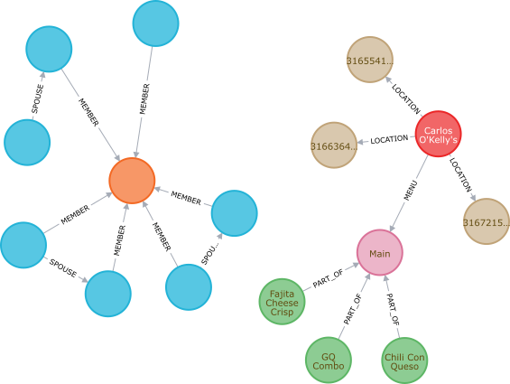

# Food Groups

This will (eventually) be an app (for web, Android, and iPhone) to coordinate groups of people gathering for meals.

## The Problems:

### Disagreements

In my experience, getting more than one individual to agree on what to have for lunch can be a _major_ chore. The goals of this app are to simplify the decision making by taking into account

- individual preferences
  - restaurant style
  - beverage options
  - dietary restrictions
  - variety
- individual locations
- price
- volume level
- entertainment
  - live music
  - sports on TV
  - PPV sporting events
- kid-friendliness
- hours of operation

and returning a location for lunch that's amenable to all members of the party.

### Too Many Apps

Another procedure I've seen is:

1. Look up nearby restaurants on **Zomato**
2. Match the selections to the output of **Tasteful** or **Happy Hour Finder**
3. Check their ratings on **Yelp**
4. Reserve a table with **Open Table**
5. Get directions with **Google Maps**
6. Check in on **Facebook**
7. Take picture of your food on **Instagram**
8. Pay and/or get rewards using restaurant's proprietary app
9. Split the check with friends using **Venmo**
10. Rant or rave about your experience on **Twitter**

Ten steps, ten separate apps. Personally I would skip a few of them (1, 2, 3, 6, 7, 9, 10), but this is a common enough scenario. I'd like to (essentially) take the place of Zomato, Tasteful/Happy Hour Finder, and Yelp, and provide easy access to Google Maps, Open Table and/or the restaurant's app, Venmo (or similar), and whichever social media apps one chooses to connect with. A lofty goal, I know, and the likely result is app #11, but I want to give it a try.

If it gets used by my friends, I'm happy. If it makes a bit of money, I'm happier. If it makes a lot of money, I'm ecstatic.

## Examples for usage

### Scenario 1:

A group of gamers getting together before a session. One party member doesn't want burgers because he just had that for lunch, and another is allergic to chicken. Find an otherwise stereotypical tavern (where all great adventures start) that serves something other than burgers (it can serve them, but needs other entrees) and has chicken-free options.

### Scenario 2:

A group of athletes are carbo-loading for a marathon. Find a restaurant that serves pasta.

### Scenario 3:

A couple out for a blind date, and live on opposite sides of town. Find a casual restaurant somewhere in the middle that serves wine and is conducive to conversation (no loud music).

### Scenario 4:

A group of developers is getting together to socialize. Find a place that can accommodate a large group, that serves Jolt Cola, and is a reasonable distance from all individuals.

## The types of "questions" you can ask:

- Find a casual restaurant halfway between party A and party B that serves Diet Dr Pepper, but isn't Applebee's.
- Find a fast-food joint that I haven't been to in a while.
- What's the newest place in town?
- What's the oldest Mexican restaurant in town?
- Where can I find live music and sushi?

## Expected General Usage:

- Open app
- Choose predefined group or search for/select individuals
- Click/press "Find Restaurant"
- See ranked choices (Top 5? Configurable?). Option to send choices to others for review (push notifications, SMS, and/or email)
- Review process allows a veto on specific restaurants, proposal of further options, or dropping out of group; will prompt for revote if mutual agreement cannot be reached
- After selection has been made, send message to selected individuals with directions to choice (push notifications, SMS, and/or email)

# Definitions

Some definitions must be established for this to work, as different people, even using the same language, may have different ideas on what to call something. The following are tentative definitions I've come up with, but are by no means exhaustive, and may not be correct.

- Service style:
  - Casual: order from a menu while seated at a table; food is delivered to the table. Check may be paid at the table or at a register.
  - Fast Food: order, pay, and pick up food from the counter prior to being seated.
  - Fast Casual: order and pay at the counter, but limited table service brings food to the table.
  - Buffet: after being seated and possibly ordering drinks, individuals choose their own food from the buffet.
  - Cafeteria: pick prepared food, then pay for the items at a common register
  - Other possibilities:
    - Teppanyaki
    - Mongolian Barbecue
    - Fine dining (dress code)

# Agenda

1. Determine database and framework to utilize.
   - After many iterations, I'm leaning toward a graph database (Neo4j? OrientDB?)
     - Here's a Neo4j graph with some dummy data.
       
       - Blue is a "Person" (names redacted)
         - I added "SPOUSE" as a relationship because I thought it might be nice to add in anniversary reminders.
       - Orange is a defined "Group" (name redacted)
       - Red is a restaurant
       - Brown is a restaurant location
       - Pink is a menu
       - Green is a menu item
         - Right now, 'category:appetizer' is a property on the menu item. Should it be a node? I don't think so, but I'm not sure.
   - React? Angular? Vue? Something else? I'm somewhat familiar with React already...
   - Needs to be multi-platform. Electron?
2. Build database schema
3. Build basic CRUD interface
4. Populate database (crowdsource with select trusted individuals)
5. Begin work on real application
   - develop roadmap
   - user stories
   - sprints
   - blah blah blah

# Issues I've Encountered

I've worked on this on-and-off for years, and have encountered issues with each type of database I've attempted (relational, document, graph) in storing appropriate data. Perhaps they can be glossed over at early stages of the project, but they will need to be addressed at some point. Here's a list of some of those that probably have obvious solutions I haven't thought of yet:

- Menus and Prices:
  - Some restaurants may have a common menu, but prices in Podunk, Kansas and Honolulu, Hawaii differ greatly
  - Some restaurants have different menus for each location
  - Some restaurants have local dishes added to particular locations, or a limited menu with fewer items than the main menu
  - Many restaurants have regular specials, e.g. happy hour drink specials, half-price appetizers after a certain time, etc.
- Hours of Operation:
  - How best do I store these? Something like "Mon-Thur 11:00-10:30, Fri-Sun 11:00-2:00am" can be parsed by a(n English speaking) human, but not so much by a machine. I only want to return results of locations that are open, so that's an issue. I tried to implement [RFC2445](https://tools.ietf.org/html/rfc2445) as best as I could using periods and recurrence rules, and while this still might be a viable option, I didn't find (m)any existing implementations that covered all likely possibilities.
